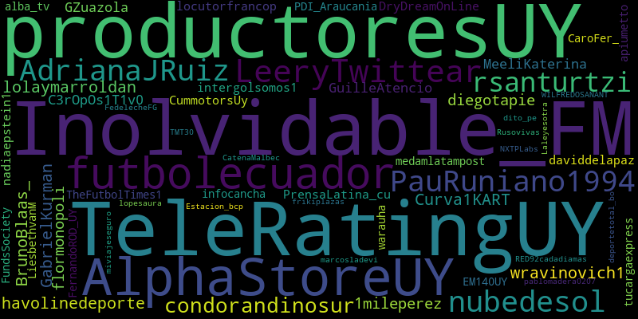
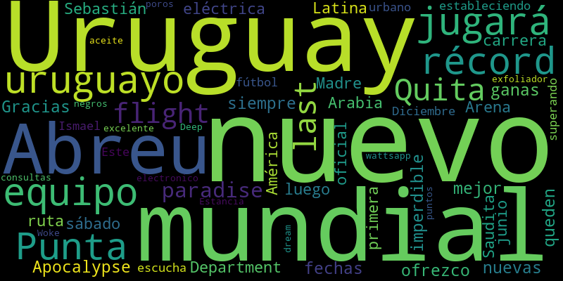
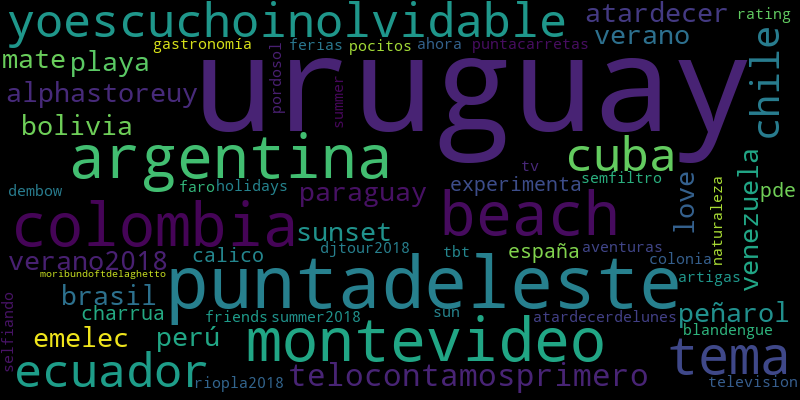
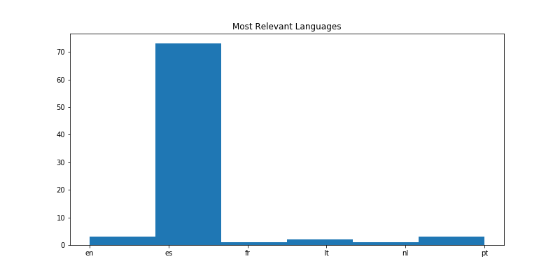

# TwitterAnalyticsPythonScript
Twitter text mining de menciones y palabras mas usadas.

Por ahora solo genera tres nubes de palabras (wordcloud) con los usuarios mas activos, palabras y hashtags mas relevantes, y un histograma de idiomas mas usados en los tuits.

## Ejemplo de resultados para "@Uruguay OR #Uruguay"

### Usuarios más activos (screen_names) 




### Palabras mas relevantes




### Hashtags mas relevantes



### Idiomas mas relevantes



## Usándolo en línea de comandos

Este script se puede usar en línea de comandos.

La sintaxis sería algo así:

python3 visualizaciones.py "que buscar" "/camino/nombre_imagen_users.png"  "/camino/nombre_imagen_words.png"  "/camino/nombre_imagen_hashtags.png" "/camino/nombre_imagen_tweetlangs.png"

Esto devolverá una cadena JSON la cual contiene el camino a las imágenes generadas, la extracción de los links a las imágenes compartidas en las publicaciones con los links a su tuit, y  las url's compartidas en todos los tuits:

```json
{
  "images": {
    "users": "/camino/nombre_imagen_users.png",
    "words": "/camino/nombre_imagen_words.png",
    "hashtags": "/camino/nombre_imagen_hashtags.png",
    "tlangs": "/camino/nombre_imagen_tweetlangs.png",
  },
  "media": {
      "tweet_images": [
        {
           "images: [
               "http://pbs.twimg.com/media/...jpg",
               "http://pbs.twimg.com/media/...jpg",
               ...
            ],
            "url": "https://twitter.com/statuses/####"
        },
        {
           "images: [
               "http://pbs.twimg.com/media/...jpg",
               "http://pbs.twimg.com/media/...jpg",
               ...
            ],
            "url": "https://twitter.com/statuses/####"
        },
        ...
       ],
      "shared_urls": [
        "https://shared_url_1...",
        "https://shared_url_2...",
        "https://shared_url_3...",
        ...
      ]
  }
}


```


Nota: Un agradecimiento a [@d4tagirl](https://github.com/d4tagirl/DuraznoConfMentions) por haber compartido su script en R que me sirvió como inspiración para este. ¡Una genia! ¡gracias!
